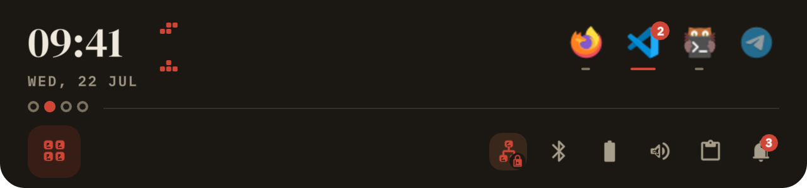
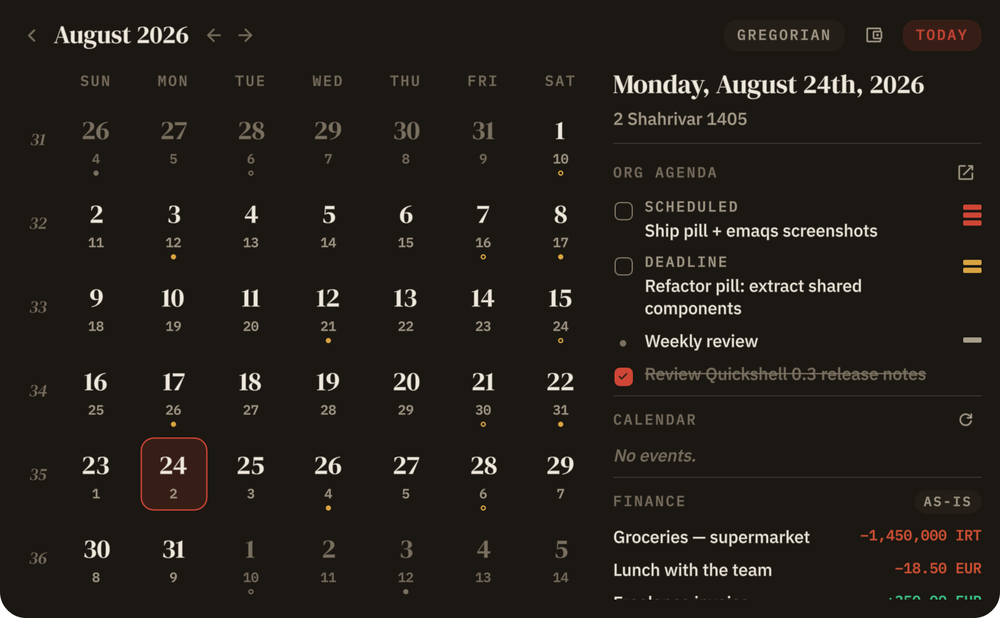
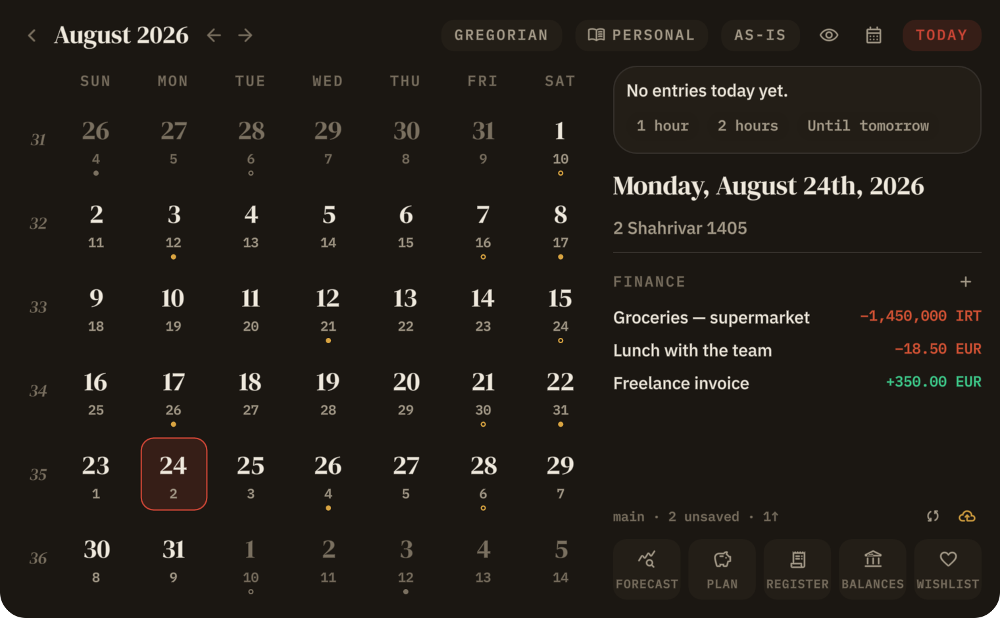
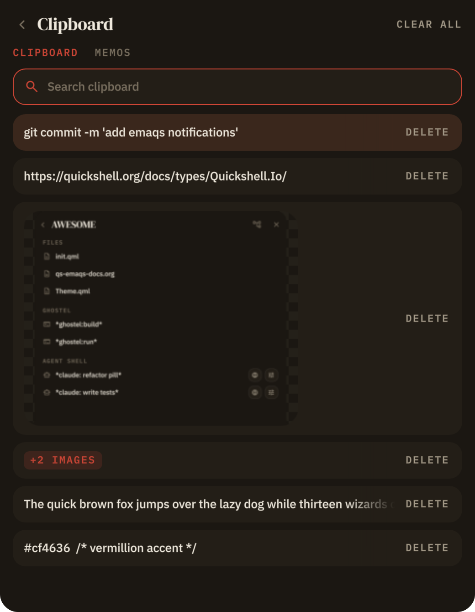
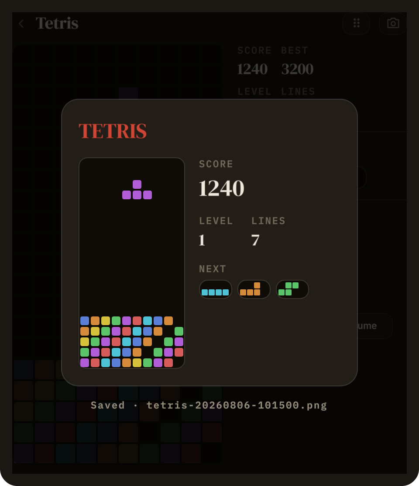
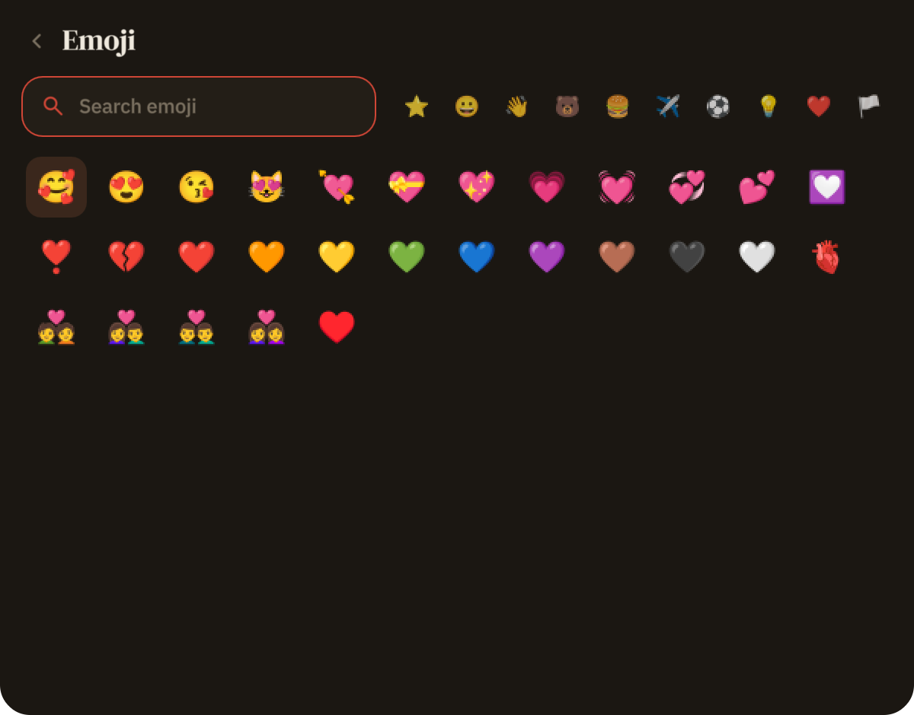
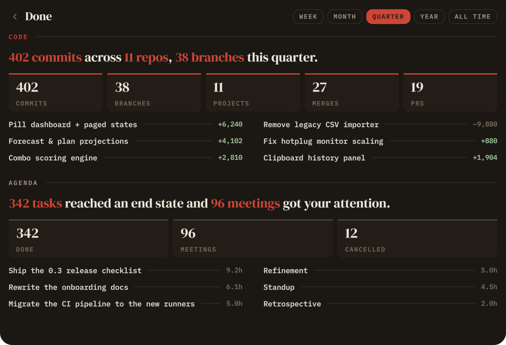

# Dotfiles

Most useful parts of my dotfiles, essentially stuff I use everyday and are heavily configured.

## Disclaimer

This repo is mostly managed and written with LLM. As it is my daily driver I haven't spent a lot of time testing or documenting everything comprehensively. but it works well for my needs and I'm sharing it as-is without guarantees.

## The pill 👉 [`quickshell/pill`](quickshell/pill)

The most interesting part of this repo is the pill. Its a quickshell module that is compact enough not to be distracting and still packs enough information to be useful.

### Some of the screenshots

|                                                                               |                                                                                     |
|-------------------------------------------------------------------------------|-------------------------------------------------------------------------------------|
|               |          |
| Idle                                                                          | Idle with pending agenda items                                                      |
|        |  |
| Dashboard                                                                     | Notification stack                                                                  |
|    |            |
| Calendar menu                                                                 | Finance menu                                                                        |
|  |        |
| Clipboard menu                                                                | Tetris                                                                              |
|   |               |
| Emoji picker                                                                  | Work summary                                                                        |

### Features

Almost everything I was using from KDE is now packed in here. Its heavily interconnected with KDE so not really sure what its portability would be without KDE dependencies.

- Window actions (move to desktop, minimize, maximize, on top, and app actions)
- Network, volume, bluetooth, the usual suspects have their own menus
- Calendar connected through KDE online accounts + custom accounts to show events
- Org agenda (emacs feature)
- Finance menu (uses hledger)
- App launcher (connected to KDE and integrates all plasma plugins)

### Usage

There is an install script and also install docs, pass it to an LLM to set it up for you to make it easier.

I have added my own KDE shortcuts, you can import them to make using the pill faster.

- **Install:** [`quickshell/INSTALL.md`](quickshell/INSTALL.md) — one-command script for Arch, full dependency list, and what degrades off KDE.
- **Internals:** [`quickshell/pill/README.md`](quickshell/pill/README.md).

### Emaqs

There's also `quickshell/emaqs`, a small bottom-edge Emacs-Doom workspace pill — only useful if you live in Emacs. It integrated with agent-shell to report and ask permissions, allows changing workspaces and buffers. For a bit of mouse support.

## Everything else

Personal config with nothing special going on, kept here mostly to sync it:

- **`zsh` / `starship`** — prompt + shell functions I use daily.
  - `zsh` config packs a few functions I use a lot:
    - `cdp` which allows navigating to projects by defining where projects live using `export PROJECT_DIRS` and supports quickly calling `npm`, `make` and other sort of runner commands
- **`mpv`** — stock `mpv.conf`/`input.conf`; the good parts are other people's
  scripts: [uosc](https://github.com/tomasklaen/uosc) (UI),
  [thumbfast](https://github.com/po5/thumbfast) (hover thumbnails), and the
  [Eisa01/mpv-scripts](https://github.com/Eisa01/mpv-scripts) suite (history,
  bookmarks, copy/paste, undo). Assembled from a config repo I can no longer
  find — those three are the credit.
  - **`emacs`** — my Emacs config. Has a bunch of cool stuff if you are interested:
    - `svg-header` multi line vscode style header which shows parent lines, buttons for quick actions and so on
    - `dashboard` shows workspaces and organizes agent-shell and ghostel buffers
    - customized theme (uses vscode's dobri theme)
    - `teamwork` allows managing teamwork.com workspaces through a buffer
    - `supermenu` a consult menu organizing workspace related buffers and more
    - `github-pr` manage your pr comments from emacs
    - and a few smaller stuff

## Final thoughts

Again, this is heavily written with LLM. Please be mindful of that if you decide to use any of the code here.
